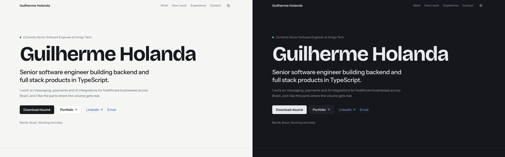

# guilherme-holanda

[](https://github.com/guilhermeholanda2010/guilherme-holanda/actions/workflows/ci.yml)

Personal website of Guilherme Holanda, Senior Software Engineer (backend and full stack). A single, text-only page: selected work at Amigo Tech, a personal project, how I work, experience and contact. Light and dark themes, a few purposeful animations that respect `prefers-reduced-motion`, and a Lighthouse score of 95+ in every category on mobile.

**Live:** LIVE_URL



## Stack

- React 19, Vite, TypeScript (strict)
- Tailwind CSS v4, with design tokens as CSS variables in `src/styles/tokens.css`
- Motion (`motion/react`) for animation, loaded lazily through `LazyMotion`
- Self-hosted fonts via Fontsource: Bricolage Grotesque, Instrument Sans, JetBrains Mono
- Vitest + Testing Library, Playwright, ESLint, Prettier
- GitHub Actions for CI, Vercel for hosting

## Run it locally

Requires Node 22 (see `.nvmrc`) and pnpm.

```sh
nvm use
pnpm install
pnpm dev
```

## Scripts

| Script           | What it does                                                        |
| ---------------- | ------------------------------------------------------------------- |
| `pnpm dev`       | Dev server at http://localhost:5173                                 |
| `pnpm build`     | Typecheck and production build to `dist/`                           |
| `pnpm preview`   | Serve the production build                                          |
| `pnpm lint`      | ESLint                                                              |
| `pnpm format`    | Prettier (write); `pnpm format:check` to verify                     |
| `pnpm typecheck` | TypeScript, no emit                                                 |
| `pnpm test`      | Unit tests (Vitest)                                                 |
| `pnpm test:e2e`  | Playwright smoke test against the production build                  |
| `pnpm og`        | Regenerate `public/og-image.png` from the name and title in content |

## Editing content

All copy, numbers and links live in [`src/content.ts`](src/content.ts), fully typed. Components never hardcode text, and the `<head>` tags (title, description, Open Graph, JSON-LD) are generated from the same file at build time by a small Vite plugin in `vite.config.ts`.

- Any link set to `TODO` is hidden. Set `identity.github` to show the GitHub links.
- Numbers use `{ prefix, value, suffix }` so they can count up; use `display` for values that shouldn't (like a range).
- Drop the PDFs into `public/` as `resume-guilherme-holanda.pdf` and `portfolio-guilherme-holanda.pdf`.

## Project layout

```
src/
  content.ts     all site copy and data
  sections/      one component per page section
  components/    small shared pieces (case study, stat, worktree panel, links)
  theme/         theme provider, toggle logic, view-transition switch
  hooks/         reduced motion, count-up, scroll position
  styles/        tokens.css and global.css
tests/
  unit/          theme toggle, reduced motion, content integrity
  e2e/           Playwright smoke test
```

## Deployment

Vercel builds every push to `main` for production and every pull request for a preview URL (`pnpm build`, output `dist`).

### Adding a custom domain later

1. Buy the domain (for example `guilhermeholanda.dev`) and add it in Vercel: **Project → Settings → Domains**. Follow the DNS records Vercel shows (an `A` record for the apex, a `CNAME` for `www`).
2. In `src/content.ts`, set `site.url` to the new origin, with no trailing slash:
   ```ts
   url: 'https://guilhermeholanda.dev',
   ```
   This updates the canonical URL, `og:url`, the absolute `og:image` URL and the JSON-LD `url` on the next build.
3. Push to `main`. After it deploys, check the link preview with the [LinkedIn Post Inspector](https://www.linkedin.com/post-inspector/) so LinkedIn refreshes its cache.
